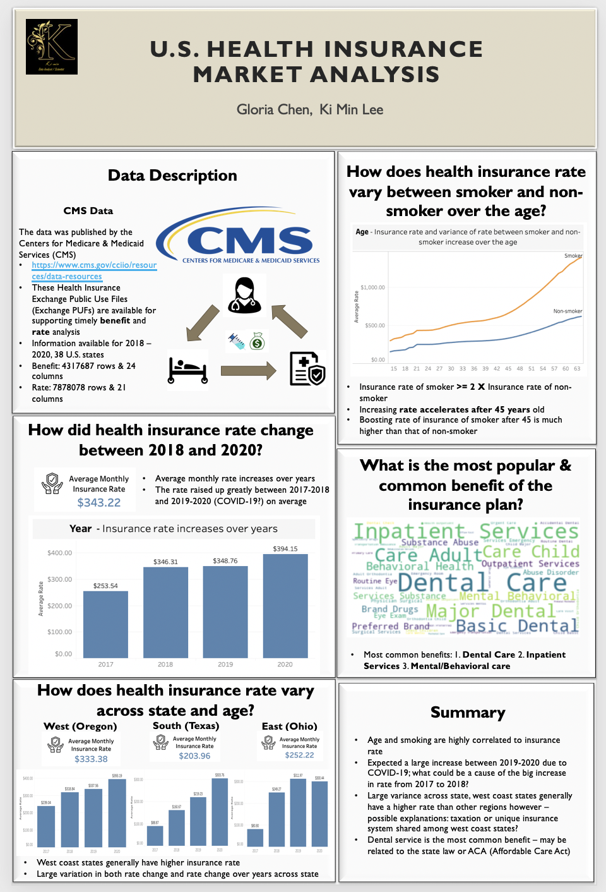

# U.S.-Healthcare-Insurance-Rate-Analysis

## Research Questions
1. How do health insurance rates vary across state?
2. How did health insurance rates change from 2018 to 2020? And how did Covid-19 impact on US health insurance market?
3. How do health insurance rates vary between smokes and non-smokers?

## About Data
- Data obtained from CMS.gov: Centers for Medicare & Medicaid Services
https://www.cms.gov/cciio/resources/data-resources
- These Health Insurance Exchange Public Use Files (Exchange PUFs) are available for supporting timely benefit and rate analysis.
- Six datasets including 'Benefits and Cost Sharing', 'Rate', 'Plan Attributes', 'Business Rules', 'Service Area' and 'Network'
- Collected and joined 2018 - 2020 datasets
- The datasets contain medical insurance information of 38 states of the U.S.

## Dataset Conversion & Technical Appendix
* Dataset Compression Into Parquet File: [csv_to_parquet](https://github.com/kilee722/us_health_insurance_rate/blob/main/csv_to_parquet.ipynb)
* Technical Appendix File: [Healthcare_appendix.ipynb]()

##  Exploratory Data Analysis on 38 U.S. states' health insurance rate

<noscript></noscript><object class='tableauViz'  style='display:none;'><param name='host_url' value='https%3A%2F%2Fpublic.tableau.com%2F' /> <param name='embed_code_version' value='3' /> <param name='site_root' value='' /><param name='name' value='Health_Rate_Dashboard_Complete_16120607649420&#47;Dashboard1' /><param name='tabs' value='no' /><param name='toolbar' value='yes' /><param name='static_image' value='https:&#47;&#47;public.tableau.com&#47;static&#47;images&#47;He&#47;Health_Rate_Dashboard_Complete_16120607649420&#47;Dashboard1&#47;1.png' /> <param name='animate_transition' value='yes' /><param name='display_static_image' value='yes' /><param name='display_spinner' value='yes' /><param name='display_overlay' value='yes' /><param name='display_count' value='yes' /><param name='language' value='en' /></object>
                

[Interative Dashboard Link]
https://public.tableau.com/views/Health_Rate_Dashboard_Complete_16120607649420/Dashboard1?:language=en&:display_count=y&:origin=viz_share_link

## Project Outcome
* Insurance rate varies by state, the west coast has a higher insurance rate in general
* The variance of insurance between smoker and non-smoker significantly increased age after 45 
* The average insurance rate increased by 0.7% from 2018 to 2019, the average insurance rate increased by 14.8% from 2019 to 2020 (COVID-19 impact on the market)
* The most significant influencing factors of the insurance rate - *Age, Smoker/Non-smoker, Location (State)*
* Dental care is the most common benefit of the insurance plan

## Technology
* Python
  * pandas
  * seaborn
  * matplotlib
  * ploitly
* Tableau Public

## References
Centres for Medicare & Medicaid Services (CMS.gov).(2021). Retrieved from https://www.cms.gov/cciio/resources/data-resources/
